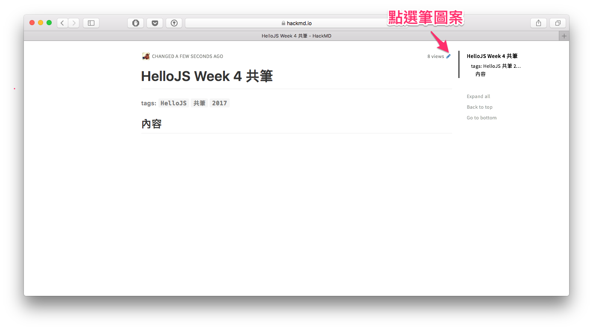
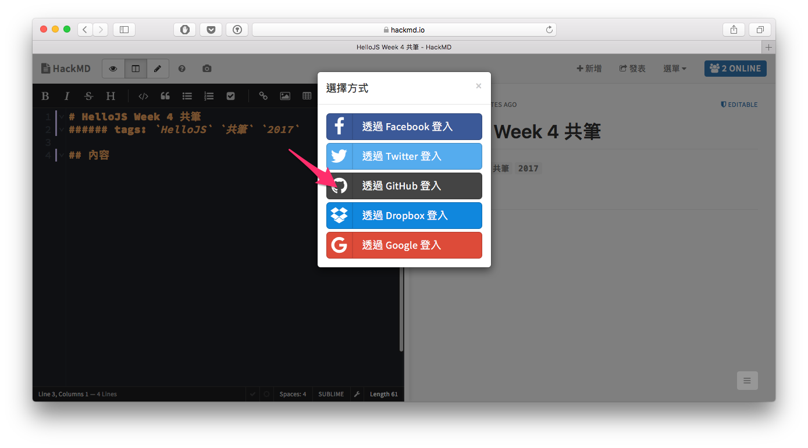

# HelloJS Summer Camp 共同筆記

這邊是 HelloJS 訓練營每週的共筆搜集目錄。

## 目錄
- [Week-1 hackMD](https://hackmd.io/s/r1Qzre9Vb)
- [Week-2 hackMD](https://hackmd.io/s/r1qiHlq4b)
- [Week-3 hackMD](https://hackmd.io/s/r1ebUe9NW)
- [Week-4 hackMD](https://hackmd.io/s/S1q7Llc4-)
- [Week-5 hackMD](https://hackmd.io/s/B11qOgc4-)
- [Week-6 hackMD](https://hackmd.io/s/Skoi_ecVb)
- [Week-7 hackMD](https://hackmd.io/s/Sks2_ecVZ)
- [Week-8 hackMD](https://hackmd.io/s/BkpPFgc4-)

## 如何撰寫共筆

開啟共筆後會導向 `HackMD` 服務，點選下圖中之`筆`圖案即可。

進入編輯模式時請點選左側編輯區任一部分，然後使用 `Github` 帳號登入 `HackMD` 服務；登入後即可開始編輯。
